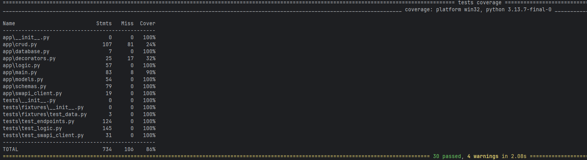

# StarWarsUniverse
A project to explore the Star Wars universe using the SWAPI (Star Wars API). This project fetches data about films, characters, and starships.
<br>It stores them in a database and provides a simple interface to view the information.
<br>Moreover it provides the possibility to search for all entities by name.

## Features
- Fetches data from the SWAPI.
- Stores data in a SQLite database.
- Provides endpoints to view all stored data.
- Provides endpoints to search for films, characters, and starships by name.

## Setup
1. Clone the repository:
   ```bash
   git clone https://github.com/Spareman/StarWarsUniverse.git
2. Navigate to the project directory:
   ```bash
   cd StarWarsUniverse
   ```
3. Install docker and docker-compose if you haven't already.
4. Build and run the Docker containers:
   ```bash
   docker-compose up --build
   ```
5. The application will be accessible at `http://localhost:8000`.
6. To stop the application, press `CTRL + C` and then run:
   ```bash
   docker-compose down
   ```
## Run tests
To run the tests, execute the following command:
```bash
pip install -r requirements.txt
pytest
```
## Coverage report

   
## Endpoint usage
- Fetch and store films from SWAPI: `POST /store/films`
- Fetch and store characters from SWAPI: `POST /store/characters`
- Fetch and store starships from SWAPI: `POST /store/starships`
- Fetch and store all entities from SWAPI: `POST /store/all`
- View all films (paginated): `GET /films/?page={page_number}&page_size={page_size}`
- View all characters (paginated): `GET /characters/?page={page_number}&page_size={page_size}`
- View all starships (paginated): `GET /starships/?page={page_number}&page_size={page_size}`
- Search films by name: `GET /search/films/?film_name={name}`
- Search characters by name: `GET /search/characters?character_name={name}`
- Search starships by name: `GET /search/starships?starship_name={name}`

**Note:** *page_size* defaults to 20 and has a maximum value of 100.
